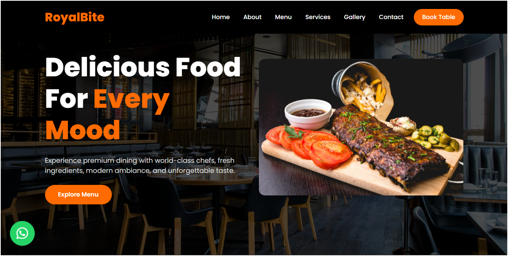
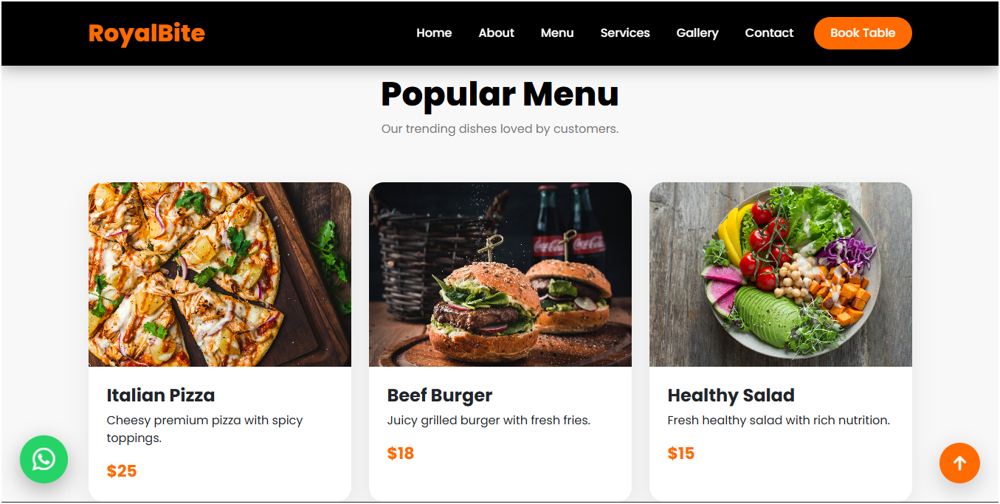
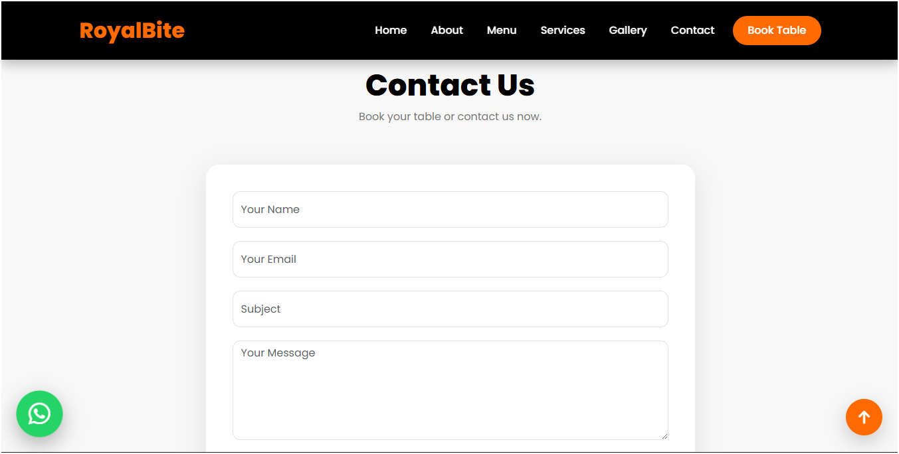

# 🍽️ RoyalBite Restaurant Website

A modern, responsive and premium restaurant website built using HTML5, CSS3, JavaScript and Bootstrap 5. This project is designed for restaurant businesses, food startups, cafes and portfolio showcase purposes.

---

# 🚀 Live Demo

[https://your-netlify-link.netlify.app](https://muzamal478.github.io/royalbite-restaurant/)

---

# 📌 Project Overview

RoyalBite is a fully responsive restaurant website with modern UI/UX design, smooth animations, premium layout and interactive sections. The website is designed to provide a professional online presence for restaurants and food businesses.

This project includes:

- Responsive design
- Hero section
- Modern navbar
- Food menu cards
- Gallery section
- Testimonials
- WhatsApp integration
- Contact form
- Back to top button
- Smooth scrolling
- Bootstrap responsive layout
- Premium restaurant UI design

---

# 🛠️ Technologies Used

- HTML5
- CSS3
- JavaScript
- Bootstrap 5
- Font Awesome
- Google Fonts

---

# ✨ Features

## ✅ Modern Hero Section
Premium hero section with background image, CTA button and responsive layout.

## ✅ Responsive Navigation Bar
Fully responsive navbar for desktop, tablet and mobile devices.

## ✅ Food Menu Cards
Beautiful restaurant menu cards with hover effects and modern styling.

## ✅ About Section
Professional restaurant information section with modern layout.

## ✅ Services Section
Restaurant services showcase with icons and hover animations.

## ✅ Customer Testimonials
Client reviews and testimonial cards.

## ✅ Food Gallery
Modern responsive image gallery section.

## ✅ Contact Form
Working contact form using mailto integration.

## ✅ WhatsApp Button
Floating WhatsApp contact button.

## ✅ Back To Top Button
Smooth scrolling back-to-top button.

## ✅ Mobile Responsive
Fully responsive for all screen sizes.

---

# 📂 Project Structure

```bash
royalbite-restaurant/
│
├── index.html
├── README.md
```

---

# ⚙️ Installation

## Step 1

Clone the repository:

```bash
git clone https://github.com/yourusername/royalbite-restaurant.git
```

## Step 2

Open project folder:

```bash
cd royalbite-restaurant
```

## Step 3

Open `index.html` in browser.

---

# 🌐 Deployment

This project can be deployed easily on:

- Netlify
- Vercel
- GitHub Pages

---

# 🚀 Netlify Deployment

## Step 1

Login to Netlify.

## Step 2

Drag and drop project folder.

OR connect GitHub repository.

## Step 3

Deploy website.

---

# 🔧 Customization

You can easily customize:

- Restaurant name
- Images
- Colors
- Menu items
- WhatsApp number
- Email address
- Social media links

---

# 📱 Responsive Design

The website is optimized for:

- Mobile devices
- Tablets
- Laptops
- Desktop screens

---

# 🎨 UI/UX Design

This project follows:

- Modern SaaS design principles
- Premium restaurant styling
- Clean typography
- Professional spacing
- Smooth animations
- Interactive hover effects

---

# 🔍 SEO Features

- Semantic HTML structure
- Responsive layout
- Fast loading
- Mobile-friendly design
- Clean code structure

---

# 📸 Screenshots

## Hero Section



## Menu Section



## Contact Section



---

# 📞 Contact Information

For project collaboration or freelance work:

- Email: yourgmail@gmail.com
- WhatsApp: +92 300 1234567

---

# 👨‍💻 Author

Developed by:

Your Name

---

# 📄 License

This project is open-source and free to use for educational and portfolio purposes.

---

# ⭐ Support

If you like this project:

- Star the repository
- Share the project
- Fork the repository

---

# 🔥 Future Improvements

- Online table booking
- Admin dashboard
- Dark mode
- Food ordering system
- Payment integration
- Advanced animations
- Multi-page layout

---

# 💡 Project Purpose

This website was created as a professional restaurant portfolio project for showcasing frontend development skills and premium UI/UX design.

---

# 🏆 Final Result

A modern, elegant and responsive restaurant website suitable for:

- Restaurants
- Cafes
- Food startups
- Hotel businesses
- Portfolio showcase
- Freelance projects

---

# 📌 Repository Name

```bash
royalbite-restaurant
```

---

# 🌍 Live Website

```bash
https://royalbite-restaurant.netlify.app
```

---

# ❤️ Thank You

Thank you for visiting this project.
Feel free to use, customize and improve it.
